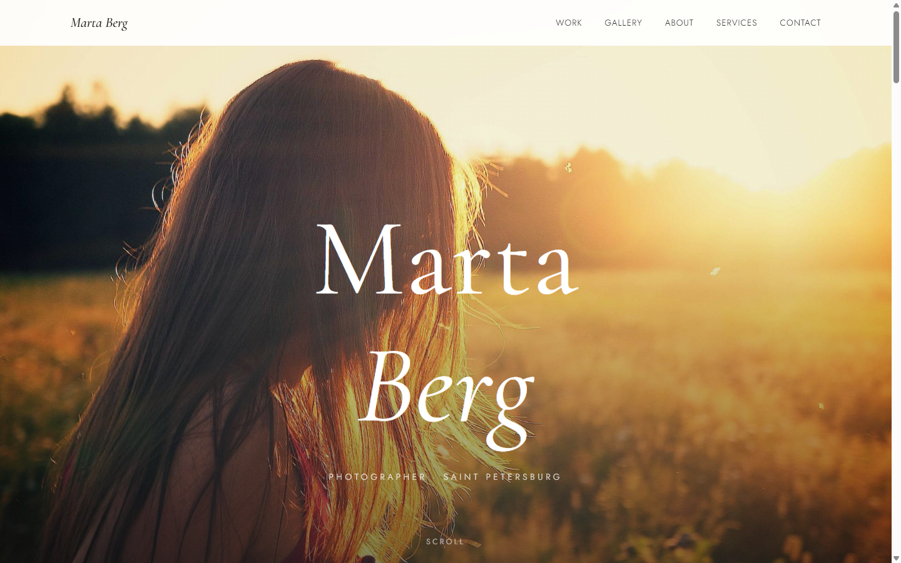

# Marta Berg — сайт-портфолио фотографа

Одностраничное портфолио фотографа из Санкт-Петербурга: портрет, свадьбы, editorial. Фотограф вымышленный, это концепт для портфолио — снимки и контакты демонстрационные. Ванильные HTML, CSS и JavaScript, без фреймворков и сборки.

**Живой сайт:** [hmsusbusas-png.github.io/marta-berg](https://hmsusbusas-png.github.io/marta-berg/)



## Что внутри

- Фиксированная навигация с бургер-меню на мобильных
- Полноэкранный hero с крупной display-типографикой
- Секция избранных работ: три больших фото с ленивой загрузкой
- Masonry-галерея на CSS columns: фото плавно проявляются после загрузки, при наведении зум
- Лайтбокс с навигацией по Esc и стрелкам, подписи к кадрам
- Блок «Обо мне» с биографией и ключевыми фактами
- Услуги с ценами, отзывы, форма заявки с клиентской валидацией и состоянием успешной отправки
- Плавный скролл по якорям, reveal-анимации, SEO и Open Graph мета-теги, SVG favicon

## Как посмотреть

Открыть `index.html` в браузере — этого хватит. Вариант с локальным сервером:

```powershell
# PowerShell, из папки проекта
python -m http.server 8000
# дальше открыть http://localhost:8000
```

(или `npx serve .`, если удобнее Node)

## Честно об ограничениях

- Форма заявки ничего не отправляет: валидация и «спасибо» отрабатывают на клиенте, бэкенда нет
- Все фотографии — заглушки с picsum.photos, к реальным работам отношения не имеют
- Имя, биография, цены и контакты демонстрационные

## Структура

```
marta-berg/
├── index.html        # разметка
├── css/style.css     # стили, masonry на CSS columns
├── js/main.js        # меню, галерея, лайтбокс, форма, reveal-анимации
├── screenshots/      # desktop.png, mobile.png
└── favicon.svg
```

## Стек

HTML, CSS, ванильный JavaScript. Галерея — чистый CSS columns, лайтбокс написан руками, библиотек нет.

---

## EN

Single-page portfolio for a fictional Saint Petersburg photographer (portrait, wedding, editorial). Vanilla HTML/CSS/JS, no build step: masonry gallery on CSS columns, lightbox with Esc/arrow navigation, contact form with client-side validation. Photos are picsum placeholders, contacts are demo. Open `index.html` or run `python -m http.server 8000`. Live: https://hmsusbusas-png.github.io/marta-berg/
